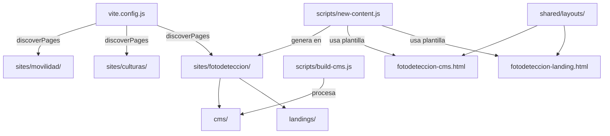

# Documento de Diseño Técnico

## Overview

Este documento describe el diseño técnico para agregar el sitio **fotodeteccion** al gestor multi-sitio. El cambio consiste en replicar la estructura existente de los sitios `movilidad` y `culturas`, extendiendo la configuración de build, los scripts de generación de contenido y el registro de rutas.

El alcance incluye:
- Creación de la estructura de carpetas `sites/fotodeteccion/`
- Layouts compartidos (`fotodeteccion-cms.html`, `fotodeteccion-landing.html`)
- Modificaciones a `vite.config.js`, `scripts/build-cms.js` y `scripts/new-content.js`
- Registro en `sites/routes.json`
- Contenidos de ejemplo (CMS y landing)

No se requieren nuevas dependencias npm ni cambios en la arquitectura general del proyecto.

---

## Architecture

El proyecto sigue una arquitectura multi-sitio plana donde cada sitio se ubica como carpeta hija de `sites/`. La función `discoverPages()` en Vite itera un array de nombres de sitio para generar entradas automáticamente.



### Principio de diseño

Se sigue el patrón **convención sobre configuración**: agregar `'fotodeteccion'` a los arrays `sites` existentes es suficiente para que todo el pipeline (dev server, build CMS, generación de contenido) funcione sin lógica adicional.

---

## Components and Interfaces

### 1. Estructura de carpetas (nuevo)

```
sites/fotodeteccion/
├── cms/
│   ├── .gitkeep
│   └── ejemplo-cms/
│       └── index.html
└── landings/
    ├── .gitkeep
    └── ejemplo-landing/
        ├── assets/
        │   └── .gitkeep
        ├── index.html
        ├── styles.css
        └── scripts.js
```

### 2. Layouts compartidos (nuevos archivos)

| Archivo | Propósito |
|---------|-----------|
| `shared/layouts/fotodeteccion-cms.html` | Plantilla base para contenidos CMS de fotodetección |
| `shared/layouts/fotodeteccion-landing.html` | Plantilla base para landing pages de fotodetección |

#### fotodeteccion-cms.html

Estructura idéntica a `movilidad-cms.html` con las siguientes diferencias:
- `<title>` usa sufijo ` - Fotodetección`
- Comentario interno referencia `PLANTILLA CMS - FOTODETECCIÓN`
- Incluye CDN GOV.CO (CSS + JS) y Bootstrap 5 (CSS + JS)
- Contiene `div#contenido-cms` con marcadores de inicio/fin
- Usa placeholder `{{TITULO}}` en `<title>` y `<h1>`

#### fotodeteccion-landing.html

Estructura idéntica a `movilidad-landing.html` con las siguientes diferencias:
- `<title>` usa sufijo ` - Fotodetección`
- Navbar con marca "Fotodetección Bogotá" (en lugar de logo de imagen)
- Footer con texto "Secretaría Distrital de Movilidad - Fotodetección"
- Incluye Bootstrap 5 CSS, `./styles.css`, Bootstrap 5 JS y `./scripts.js` como módulo

### 3. Modificación a `vite.config.js`

**Cambio**: Agregar `'fotodeteccion'` al array `sites` dentro de `discoverPages()`.

```javascript
// Antes
const sites = ['movilidad', 'culturas'];

// Después
const sites = ['movilidad', 'culturas', 'fotodeteccion'];
```

**Efecto**: Vite descubrirá automáticamente los HTML dentro de `sites/fotodeteccion/cms/` y `sites/fotodeteccion/landings/`, generando claves tipo `fotodeteccion-cms-ejemplo-cms` y `fotodeteccion-landings-ejemplo-landing` en `rollupOptions.input`.

### 4. Modificación a `scripts/build-cms.js`

**Cambio**: Agregar `'fotodeteccion'` al array `sites` dentro de `buildCms()`.

```javascript
// Antes
const sites = ['movilidad', 'culturas'];

// Después
const sites = ['movilidad', 'culturas', 'fotodeteccion'];
```

**Efecto**: `npm run build:cms` procesará `sites/fotodeteccion/cms/` y generará salida limpia en `dist/cms/fotodeteccion/`. La función `cleanForProduction()` se aplica igual que para los demás sitios.

### 5. Modificación a `scripts/new-content.js`

**Cambio**: Agregar `'fotodeteccion'` al array `VALID_SITES`.

```javascript
// Antes
const VALID_SITES = ['movilidad', 'culturas'];

// Después
const VALID_SITES = ['movilidad', 'culturas', 'fotodeteccion'];
```

**Efecto**: Permite ejecutar:
- `node scripts/new-content.js fotodeteccion cms <nombre>`
- `node scripts/new-content.js fotodeteccion landings <nombre>`

El script ya resuelve dinámicamente el layout como `${site}-${tipo}.html`, por lo que no requiere lógica adicional.

### 6. Registro en `sites/routes.json`

**Cambio**: Agregar entrada `"fotodeteccion"` al objeto `sites`.

```json
"fotodeteccion": {
  "baseUrl": "https://www.movilidadbogota.gov.co/fotodeteccion",
  "localPrefix": "sites/fotodeteccion",
  "contents": []
}
```

**Decisión de diseño**: `contents` se inicializa vacío (`[]`). Los contenidos de ejemplo (`ejemplo-cms`, `ejemplo-landing`) son internos para referencia del equipo y no representan rutas públicas reales. Se agregarán entradas cuando se publique contenido real.

---

## Data Models

### Estructura de entrada en `routes.json`

```typescript
interface SiteEntry {
  baseUrl: string;        // URL pública base del sitio
  localPrefix: string;    // Prefijo de ruta local (siempre "sites/<nombre>")
  contents: ContentEntry[];
}

interface ContentEntry {
  slug: string;           // Identificador URL-friendly
  type: "cms" | "landings";
  localPath: string;      // Ruta relativa al archivo local
  publicPath: string;     // Ruta pública en el sitio
  description: string;    // Descripción legible
}
```

### Placeholder de layouts

| Placeholder | Uso | Reemplazo |
|-------------|-----|-----------|
| `{{TITULO}}` | `<title>` y `<h1>` | Title Case del slug (e.g., `mi-pagina` → `Mi Pagina`) |

---

## Error Handling

### Scripts modificados

| Escenario | Script | Comportamiento |
|-----------|--------|----------------|
| Sitio inválido proporcionado | `new-content.js` | Muestra lista de sitios válidos (incluyendo `fotodeteccion`) y sale con código 1 |
| Carpeta ya existe | `new-content.js` | Muestra error y sale con código 1 sin modificar |
| Nombre vacío/faltante | `new-content.js` | Muestra uso correcto y sale con código 1 |
| Carpeta `cms/` vacía | `build-cms.js` | Continúa sin error; no genera archivos para ese sitio |
| Layout no encontrado | `new-content.js` | Genera HTML básico de fallback (comportamiento existente) |

### Validación de `routes.json`

El archivo debe ser JSON válido después de la modificación. Se verifica manualmente que `JSON.parse()` no lance error.

---

## Testing Strategy

### Por qué no aplica Property-Based Testing

Este feature es scaffolding de configuración y plantillas HTML estáticas. No hay funciones puras con entradas/salidas variables, ni transformaciones de datos, ni algoritmos. Los cambios son:
- Adición de un string a arrays existentes
- Creación de archivos estáticos con contenido fijo
- Registro de una entrada JSON con valores conocidos

La estrategia apropiada es **verificación basada en ejemplos** y **smoke tests**.

### Plan de verificación

#### 1. Verificación de estructura (manual/automatizable)

- [ ] Existe `sites/fotodeteccion/cms/.gitkeep`
- [ ] Existe `sites/fotodeteccion/landings/.gitkeep`
- [ ] Existe `sites/fotodeteccion/cms/ejemplo-cms/index.html`
- [ ] Existe `sites/fotodeteccion/landings/ejemplo-landing/index.html`
- [ ] Existe `sites/fotodeteccion/landings/ejemplo-landing/styles.css`
- [ ] Existe `sites/fotodeteccion/landings/ejemplo-landing/scripts.js`
- [ ] Existe `sites/fotodeteccion/landings/ejemplo-landing/assets/.gitkeep`

#### 2. Verificación de layouts

- [ ] `shared/layouts/fotodeteccion-cms.html` es HTML5 válido con `lang="es"`
- [ ] Contiene referencia a CDN GOV.CO y Bootstrap 5
- [ ] Contiene `div#contenido-cms` con marcadores
- [ ] Usa `{{TITULO}}` en `<title>` y `<h1>`
- [ ] `shared/layouts/fotodeteccion-landing.html` es HTML5 válido
- [ ] Contiene `<nav>` con `aria-label` en toggler
- [ ] Contiene `<main>` y `<footer>`

#### 3. Verificación de configuración

- [ ] `vite.config.js`: array `sites` contiene `'fotodeteccion'`
- [ ] `scripts/build-cms.js`: array `sites` contiene `'fotodeteccion'`
- [ ] `scripts/new-content.js`: array `VALID_SITES` contiene `'fotodeteccion'`
- [ ] `sites/routes.json`: es JSON válido y contiene entrada `"fotodeteccion"`

#### 4. Smoke tests funcionales

```bash
# Verificar que Vite arranca sin errores
npm run dev  # (verificar manualmente que no hay errores en consola)

# Verificar build CMS
npm run build:cms  # Debe completar sin errores

# Verificar generación de contenido
node scripts/new-content.js fotodeteccion cms test-page
# Debe crear sites/fotodeteccion/cms/test-page/index.html

node scripts/new-content.js fotodeteccion landings test-landing
# Debe crear estructura completa en sites/fotodeteccion/landings/test-landing/

# Verificar que sitio inválido sigue fallando
node scripts/new-content.js invalido cms test  # Debe listar fotodeteccion en sitios válidos

# Limpieza post-test
rm -rf sites/fotodeteccion/cms/test-page sites/fotodeteccion/landings/test-landing
```

#### 5. Verificación de accesibilidad

- [ ] Ejemplo landing tiene `aria-label` en navbar toggler
- [ ] Imágenes tienen `alt` descriptivo
- [ ] Encabezados siguen jerarquía correcta (h1 → h2 → h3)
- [ ] Links de navegación tienen texto visible
